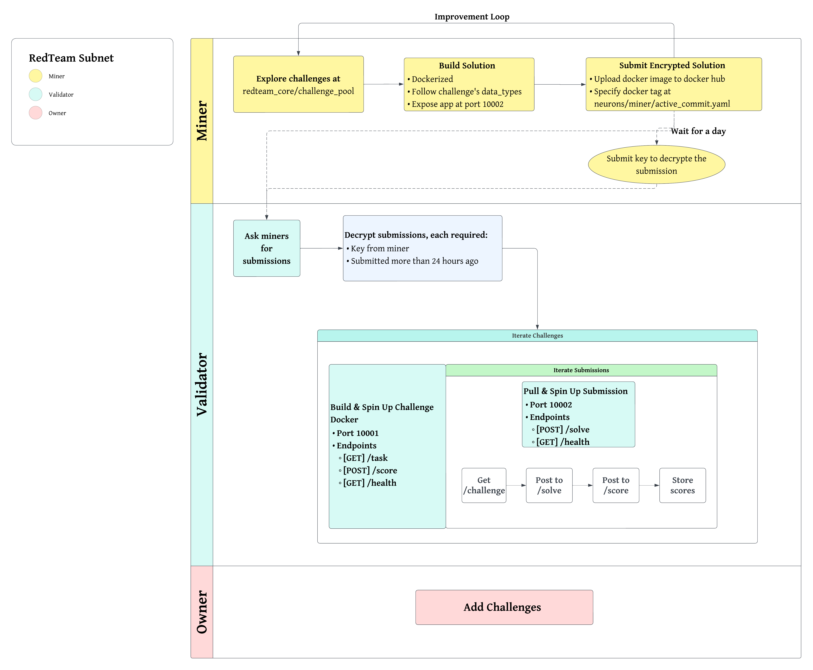

# RedTeam Subnet: Improved Security Through Decentralized Innovation

## Overview
The RedTeam subnet by Innerworks is a decentralized platform designed to drive innovation in cybersecurity through competitive programming challenges. The subnet incentivizes miners to develop and submit code solutions to various technical challenges, with a focus on enhancing security. These solutions can be integrated into real-world products to improve their security features.

## Subnet Functionality
The subnet operates with a flexible, modular structure where new programming challenges can be added or removed based on demand. Miners submit encrypted code solutions to validators, who decrypt and evaluate the submissions after a 24-hour period. This ensures the integrity of the submissions, as the original submission time is preserved, and the solutions cannot be plagiarized. Validators run the submitted code in isolated sandbox environments to ensure accurate and replicable scoring.

Points are awarded based on the quality of each solution, compared to the previous best. The system calculates emissions based on the number of points a miner has, with points decaying linearly over a 14-day period. This incentivizes continuous improvement and active participation in solving challenges.

## Example Challenge
For instance, a programming challenge may involve mimicking human language to bypass ai generated content detection algorithms. Miners develop Python scripts to trick the algorithm into thinking the generated content is human-written. The validators evaluate the submissions based on the accuracy of the generated content and award points accordingly. The best solution is selected as the benchmark for future submissions.

## Validator Setup
[Read the full documentation](docs/validator.md)

## Miner Setup
[Read the full documentation](docs/miner.md)
